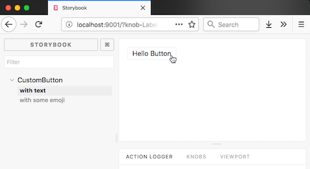
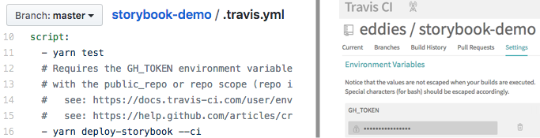
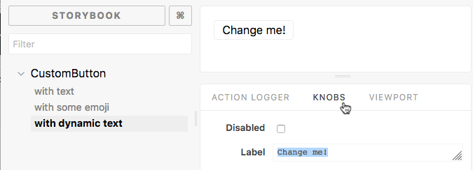
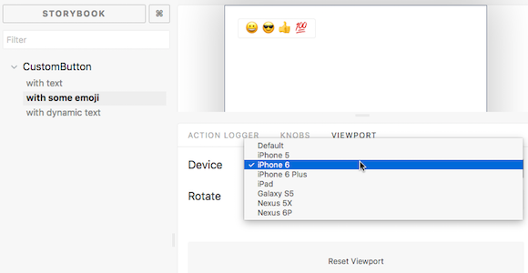

### UI Development with Storybook

#### a story about developer happiness

---

Edwin Shin

* Partner at TRA
  * Data Science Consultancy
  * Data Collaboration Platform
* eddie@tra.sg

**We're Hiring!**

https://tra.sg

---

> Storybook is a UI development environment for your UI components. With it, you can visualize different states of your UI components and develop them interactively.

Storybook is like unit-testing for UI development.

---

**Remember why we embrace unit testing?**

* It forces us to reflect on the design of our code (e.g. weighing the cost of initial development versus ease of maintenance and refactoring, modularity and re-use)

---

* Cleaner code, because (re)writing our code to be testable is often easier than writing complicated tests with lots of mocks and simulated state

---

* Validation that our code is working as intended and assurance that we haven't introduced regressions


---

Storybook encourages you to develop presentational components in isolation from the context of your full app (with all of its fully-loaded Redux/Relay/Apollo goodness).

---

Storybook can run on its own (with hot-reloading), separate from your React app or even produce a static app so that you can collaborate with (or showcase to) non-developers (designers, QA, clients, etc.).

---

### Writing a story
Once you have Storybook installed (`npm install ...`) and configured (`.storybook/config.js`), writing a story is like writing a test for a component:

---

```js
import React from 'react';
import { storiesOf } from '@storybook/react';
import CustomButton from './CustomButton';

storiesOf('CustomButton', module)
  .add('with text', () => (
    <CustomButton onClick={action('clicked')}>Hello Button</CustomButton>
  ))
  .add('with some emoji', () => (
    <CustomButton onClick={action('clicked')}><span role="img" aria-label="so cool">😀 😎 👍 💯</span></CustomButton>
  ));
```



---

Similar to Jest, I configure Storybook to load stories that end with a specific suffix (`.stories.js`). So for the component `CustomButton.js`, I'll create my story as `CustomButton.stories.js`:


```js
src/
└───components/
    └───CustomButton/
        │   CustomButton.js
        │   CustomButton.stories.js
        │   CustomButton.test.js
```

---

## CI & Testing
Storybook can generate a static app. This means we can add Storybook to your CI (e.g. Travis) build.

Even better, have your CI deploy on every build and now you have an automatic component showcase for every end-of-iteration/sprint review.

---

In this demo repo, I use [storybook-deployer](storybooks/storybook-deployer) along with Travis to publish Storybook to GitHub Pages.



---

### Structural Tests with StoryShots
StoryShots is an addon that integrates Storybook and Jest Snapshot Testing.

StoryShots isn't a replacement for unit or integration tests. When a snapshot test fails, it just means the story doesn't look like it did before.

---

When you're actively developing a component you're just going to update the snapshots without much consideration or effort. But StoryShots is most useful in making sure developers don't introduce unintended or breaking changes in the rendered output (i.e. not behavior) of components.

---

## Collaboration
Once you're publishing your stories via CI, it's also easy to adopt a more collaborative workflow where you push a branch and send a link to the static storybook build so you can get feedback on more experimental UI elements independently of getting your middleware and backend all wired up.

---

## Addons
Storybook has a number of addons developed by Storybook maintainers and the community at large.

I find Knobs and Viewport to be especially useful.

---

Knobs lets you edit React props within the Storybook UI.



---

Viewport helps you build responsive components by displaying your stories in various sizes and layouts. In v4 (in alpha as of this writing), viewports will support custom sizes.



---

## Examples
* [Airbnb Dates](http://airbnb.io/react-dates/)
* [Uber React-Vis](https://uber.github.io/react-vis/website/dist/storybook/index.html)
* [this repo](https://github.com/eddies/storybook-demo)

---

## Thanks!

Now go write your stories!
